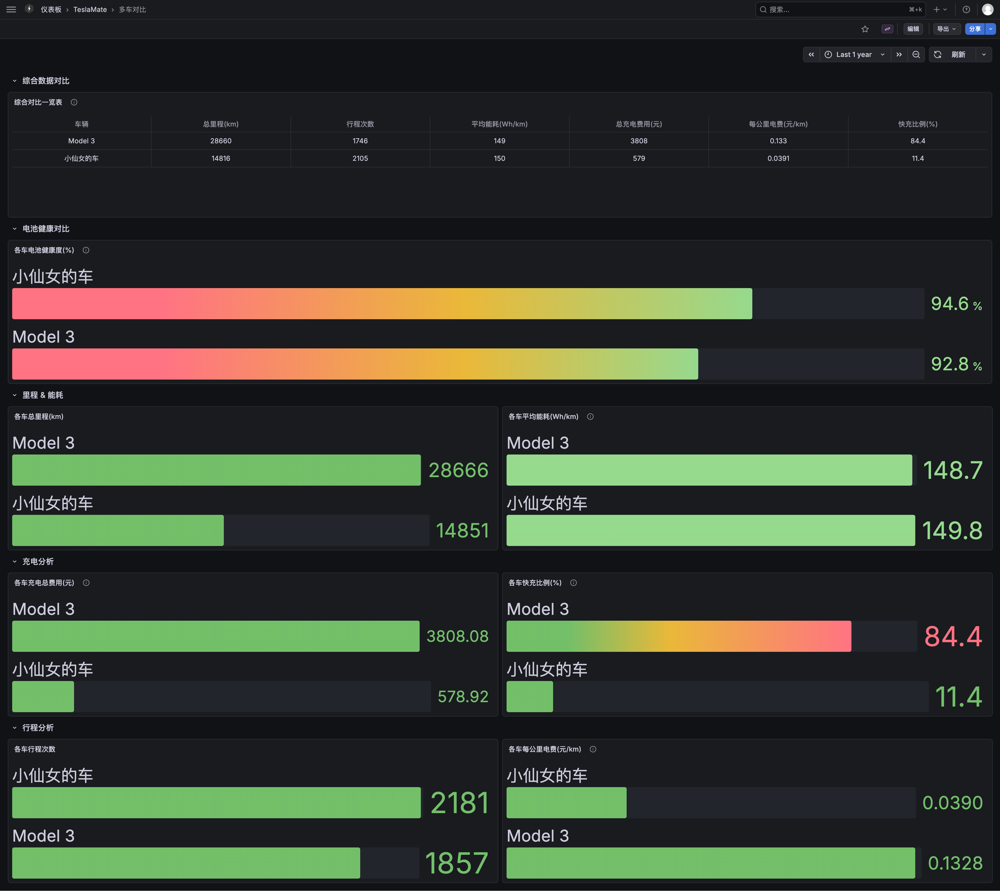
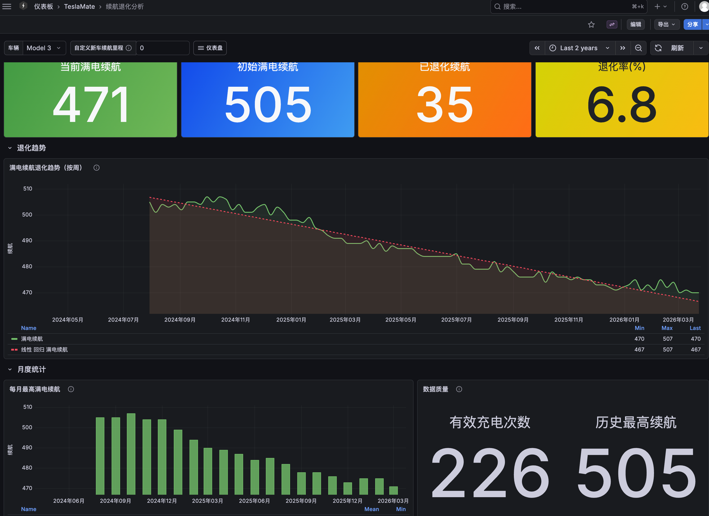
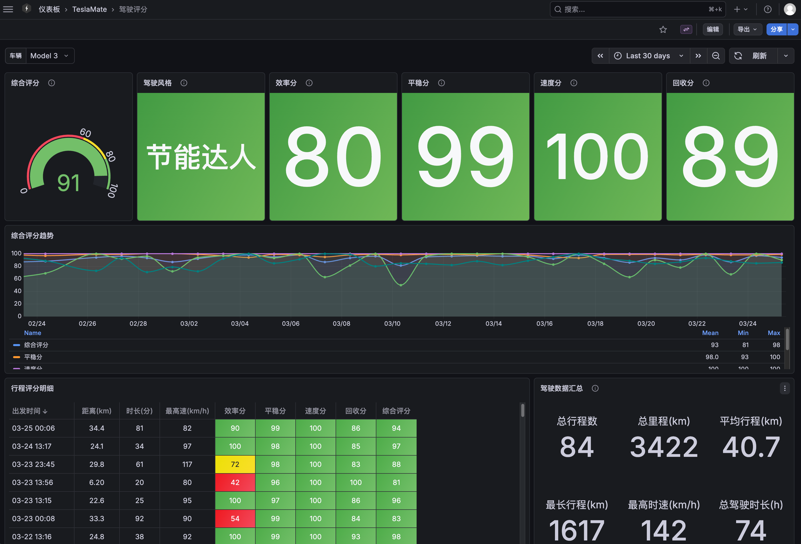

# TeslaMate 中文 Grafana Dashboard

**TeslaMate Chinese Grafana Dashboards** — Simplified Chinese localization for TeslaMate, ready to use out of the box.

简体中文汉化版 TeslaMate Grafana Dashboard - 开箱即用 | 43 个仪表盘 99% 汉化 | 支持 Docker 一键部署

---

<a id="upgrade-v16"></a>

> ## ⚡ 升级到 v1.6.x — 分时电价 + 性能索引（中文版独有）
>
> **v1.5.0 起的中文版独有功能**：
> - 🆕 「⚡ 分时电价配置」仪表盘 — 在线配置峰平谷电价 + 配置审计 + 24 小时电价分布
> - 🆕 「🏆 充电桩性价比榜」仪表盘 — 按 ¥/度 排序所有充电点
> - 🌡️ 「天气-能耗关联」仪表盘（v1.6.0）— 国内 #1 痛点「冬天到底掉多少电」量化版
> - 🚀 positions 表性能索引（v1.6.1）— 电池健康/行程列表/能耗聚合等查询从 200ms 降到 < 5ms
> - 🔧 9 个仪表盘 60+ 处 SQL 自动适配分时电价
> - **没装分时电价的用户无任何感知差异**（所有面板 fallback 原 `cp.cost`）
>
> 按你当时怎么装的，选一种：
>
> | 你之前怎么装的？ | 用哪个 |
> |---|---|
> | **没装过**（全新用户） | 跳到下方 [快速开始](#-快速开始) |
> | **官方源**（grafana 是 `teslamate/grafana`） | [方法 D](#upgrade-method-d) |
> | 跟 jheredianet 教程装的（手动 import dashboard JSON） | [方法 D](#upgrade-method-d) — 但**先 export 你改过的 dashboard JSON 备份**，迁移会用我们这一套替换 |
> | 用了我们的 `simple-deploy.sh` | [方法 A](#upgrade-method-a) |
> | `git clone` 了我们仓库 | [方法 B](#upgrade-method-b) |
> | 自己写 docker-compose 套了我们镜像 | [方法 C](#upgrade-method-c) |
>
> <a id="upgrade-method-a"></a>
>
> ### 方法 A — 一键脚本用户（之前用 `simple-deploy.sh` 装的）
>
> ```bash
> wget -qO- https://raw.githubusercontent.com/wjsall/teslamate-chinese-dashboards/main/simple-deploy.sh | bash
> ```
>
> 脚本自动检测现有安装 → 切升级模式（拉新镜像 + 装新 SQL 函数 + 重启 Grafana）。**不会重置 ENCRYPTION_KEY 或配置**。
>
> <a id="upgrade-method-b"></a>
>
> ### 方法 B — git clone 用户（之前 `git clone` 仓库装的）
>
> ```bash
> cd teslamate-chinese-dashboards
> bash scripts/upgrade.sh
> ```
>
> 自动 7 步：git pull → 检测 PG → 装地图函数 → 装分时电价 → 装性能索引（v1.6.1+）→ 检查 Grafana 插件 → 重启 Grafana。**重复跑不会丢数据**。
>
> <a id="upgrade-method-c"></a>
>
> ### 方法 C — 手动派（自己写 docker compose 套了我们镜像的）
>
> ```bash
> # 1. 拉新镜像（带 volkovlabs-form-panel 插件 + 43 个仪表盘 — 该插件给「⚡ 分时电价配置」面板提供按钮交互）
> docker compose pull && docker compose up -d
>
> # 2. 装 SQL 三件套（坐标函数 + 分时电价 + 性能索引，远程 curl 不用 git clone）
> for f in install-coord-functions install-tou install-indexes; do
>   curl -fsSL "https://raw.githubusercontent.com/wjsall/teslamate-chinese-dashboards/main/sql/${f}.sql" \
>     | docker exec -i teslamate-database-1 psql -U teslamate -d teslamate
> done
>
> # 3. 重启 Grafana
> docker compose restart grafana
> ```
>
> Watchtower 自动升镜像的用户每次升级后**只需要重跑这一段**就能拿到最新 SQL 改动（函数 / 索引 / TOU）。脚本是 `IF NOT EXISTS / CREATE OR REPLACE`，重跑零风险。
>
> <a id="upgrade-method-d"></a>
>
> ### 方法 D — 从官方源迁移（你以前是 `teslamate/grafana`）
>
> ```bash
> wget https://raw.githubusercontent.com/wjsall/teslamate-chinese-dashboards/main/migrate-from-official.sh
> bash migrate-from-official.sh
> ```
>
> 脚本预检 docker daemon + compose CLI（v1/v2 都识别）→ 找 `docker-compose.yml`（含 v2 新 `compose.yml`）→ 备份（mode 600，含 ENCRYPTION_KEY）→ 改 grafana image → 拉新镜像 → 探测 database 容器名 → 装 SQL。**TeslaMate / Postgres / MQTT 完全不动，ENCRYPTION_KEY 和数据 0 丢失**。脚本结尾会打印一行 `cp + $DC up -d` 的回滚命令，复制粘贴即可回去。
>
> ⚠️ 在 Grafana 里手动改过 dashboard 的，先到「仪表盘 → ⋮ → Export」备份 JSON，迁移完再 Import 回来 —— 我们的镜像会用我们这一套覆盖。
>
> ### 配分时电价（可选，约 3 分钟）
>
> ```bash
> bash scripts/tou-wizard.sh                 # 5 步交互式向导（git clone 用户）
> ```
>
> 或直接打开「**⚡ 分时电价配置**」仪表盘 →「**🌆 一键导入城市模板**」选你城市，配完点「**🔄 重算所有历史充电**」按钮把历史按分时电价重算。
>
> ### 升级出问题？完全可逆
>
> TeslaMate 任何表都没动，分时电价数据全在我们新建的旁路表。详见 [TROUBLESHOOTING.md「v1.5.0 分时电价升级排错 / 回滚」](TROUBLESHOOTING.md#tou-rollback) | [Telegram 交流群](https://t.me/+BeOASgmvE_IyNzNl)
>

---

> 🚗 基于 [TeslaMate](https://github.com/teslamate-org/teslamate) 项目的 Grafana Dashboard 汉化版本
>
> 📖 原版文档: https://docs.teslamate.org
>
> 🙏 早期汉化工作参考自 GitHub 用户 [@dhuar](https://github.com/dhuar) 的私有镜像 `ccr.ccs.tencentyun.com/dhuar/grafana:latest`，在此致谢


[](https://t.me/+BeOASgmvE_IyNzNl)

## 📸 效果预览

### 🌡️ v1.6.0 新增：天气-能耗关联

国内特斯拉车主 #1 痛点「冬天到底掉多少电」量化版 — 温度桶能耗曲线柱色冷蓝→热红，一眼看出「16°C 最省 / 38°C 最费」的 U 型规律 + 月度双轴 + 季节对比。


### ⚡ v1.5.0 重磅功能：分时电价系统 + 充电桩性价比榜

**「⚡ 分时电价配置」** — 24 小时电价柱图自动配色（绿=谷 / 黄=平 / 橙=峰）+ 配置审计 + 5 步交互式向导


**「🏆 充电桩性价比榜」** — 按 ¥/度 排序所有充电点（家充走分时电价、第三方走原价）+ 30 天涨/降价对比 + 充电桩地图


### 🌏 v1.4.2 重磅功能：地图源一键切换 + 自动 GCJ-02 坐标纠偏

仪表盘顶部下拉框秒切 6 种瓦片源（OSM / 高德 / 高德卫星 / 谷歌 / 谷歌卫星 / Carto）。选高德或谷歌路网时 PostgreSQL 函数自动做 WGS-84 → GCJ-02 转换，车辆轨迹精准贴合道路。


### 🆕 原创分析仪表盘

**年度驾驶报告** — 年度里程 / 充电 / 能耗 / 常去地点 TOP10


**省钱分析** — 与燃油车对比节省金额、充电时段分布、预算进度


**充电健康管理** — 充电习惯评分、SOC 分布、充电次数趋势


**停车掉电分析** — 掉电趋势、区间分布、最耗电停车 TOP20


**出行规律分析** — 时段分布、工作日 vs 周末、温度与能耗关系


**动能回收分析** — 各固件版本回收率对比、每日/每周回收能量、温度影响


**多车对比** — 名下所有车辆里程/能耗/费用/电池健康横向对比，自动适配车辆数量


**续航退化分析** — 满电续航趋势、线性回归退化率、月度统计、数据质量监控


**驾驶评分** — 效率/平稳/速度/回收四维度评分、驾驶风格判定、行程明细与数据汇总


---

### 核心仪表盘

| 概览 | 电池健康度 |
|------|-----------|
|  |  |

| 里程统计 | 充电记录 |
|---------|---------|
|  |  |

| 电池容量曲线 | 行程追踪地图 |
|------------|------------|
|  |  |

| 时间线 | 电池容量曲线（全量） |
|--------|-----------------|
|  |  |

---

## 🎯 特点

- ✅ **开箱即用** - 无需 Docker Hub 账号，直接挂载使用
- ✅ **一键安装** - 提供多种安装方式，5分钟完成部署
- ✅ **持续更新** - 通过 git pull 即可获取最新汉化
- ✅ **深度汉化** - 43 个 Dashboard，含12 个全新原创分析图表
- 🌏 **地图源一键切换（独有）** - 9 个含地图仪表盘顶部加 OSM / 高德 / 高德卫星 / 谷歌 / 谷歌卫星 / Carto 下拉框，秒切，自动 GCJ-02 坐标纠偏（v1.4.2+）
  - 国内用户告别手动改 SQL，海外华人用户也能用谷歌中文路网
- ✅ **完整适配 TeslaMate 3.0** - 同步官方全部新特性，已验证兼容 Grafana 12.4.0

## 📊 汉化成果

| 指标 | 数值 |
| --- | --- |
| Dashboard 数量 | 43个 ✅ |
| 内部详情页 | 3个（行程/充电详情）|
| 文件总大小 | ~1.2MB |
| 汉化完成度 | 99%+ |
| 质量等级 | A+ |
| 最后更新 | 2026-05-02 |

**43 个 Dashboard 深度汉化，持续优化中，开箱即用！** 🎉

## 📚 使用文档

我们为你准备了三份详细的使用指南：

| 文档 | 说明 | 适合人群 |
|------|------|----------|
| **[新手向导](QUICKSTART.md)** | 从零开始安装，含 FAQ | 完全新手 |
| **[功能地图](DASHBOARD_MAP.md)** | 43 个 Dashboard 分类导航 | 新用户 |
| **[场景速查手册](SCENE_GUIDE.md)** | 什么时候看什么 Dashboard | 所有用户 |
| **[数据指标手册](METRICS_GUIDE.md)** | 指标解释、正常范围、异常处理 | 进阶用户 |
| **[故障排查手册](TROUBLESHOOTING.md)** | 遇到问题按症状查解决方案 | 遇到问题时 |

**新手建议**：先看「新手向导」→「功能地图」→「场景速查手册」→「数据指标手册」

## 📁 包含的 Dashboard (43个)

### 核心功能 (4个)
- ✅ **概览 (Overview)** - 车辆整体状态和关键指标
- ✅ **状态 (States)** - 实时监控和当前状态
- ✅ **充电统计 (Charging Stats)** - 充电数据汇总分析
- ✅ **行程统计 (Drive Stats)** - 行驶数据汇总分析

### 充电相关 (14个)
- ✅ **当前充电状态 (Current Charge View)** - 实时充电监控
- ✅ **充电记录 (Charges)** - 历史充电记录查询
- ✅ **充电费用统计 (Charging Cost Stats)** - 充电成本分析
- ✅ **停车电量消耗 (Vampire Drain)** - 停车期间电量损耗
- ✅ **快充曲线统计 (Charging Curve Stats)** - 快充性能分析
- ✅ **快充曲线图-按运营商 (DC Charging Curves)** - 不同运营商充电对比
- ✅ **电池容量曲线图 (Charge Level)** - 电池容量趋势
- ✅ **电池健康度 (Battery Health)** - 电池退化监控
- 🆕 **续航退化分析** - 满电续航趋势、退化率、月度统计、原始数据散点
- ✅ **续航曲线图 (Projected Range)** - 预计续航分析
- 🆕 **充电健康管理** - 充电习惯评分、快充占比、SOC分布分析
- 🆕 **哨兵模式耗电分析** - 哨兵开启时长、耗电估算、地点分布
- 🆕 **⚡ 分时电价配置 (TOU Config)** - 在线配置峰平谷电价 + 配置审计 + 24 小时电价分布（v1.5.0）
- 🆕 **🏆 充电桩性价比榜 (Station Ranking)** - 按 ¥/度 排序所有充电点（v1.5.0）

### 驾驶相关 (12个)
- ✅ **当前驾驶状态 (Current Drive View)** - 实时驾驶监控
- ✅ **行程列表 (Drives)** - 行程记录查询
- ✅ **驾驶记录追踪 (Tracking Drives)** - GPS轨迹追踪
- ✅ **最近车速统计 (Speed Rates)** - 车速分布分析
- ✅ **行程统计-年月日 (Statistics)** - 按时间维度统计
- ✅ **行程统计-时间段 (Trip)** - 自定义时间段分析
- ✅ **行程统计-每次充电 (Continuous Trips)** - 单次充电行程分析
- 🆕 **出行规律分析** - 时段分布、工作日vs周末、温度与能耗关系
- 🆕 **年度驾驶报告** - 年度里程/费用/亮点，常去地点TOP10
- 🆕 **动能回收分析** - 各固件版本回收率/功率对比、每日趋势、速度区间分析
- 🆕 **驾驶评分** - 效率/平稳/速度/回收四维度综合评分、驾驶风格判定、行程明细
- 🆕 **🌡️ 天气-能耗关联 (Weather Efficiency)** - 温度桶能耗曲线 + 季节对比（v1.6.0）

### 车辆状态 (6个)
- ✅ **最近车辆状态 (Current State)** - 车辆最新状态
- ✅ **胎压 (Tire Pressure)** - 轮胎压力监控
- ✅ **能效 (Efficiency)** - 能耗效率分析
- ✅ **车辆里程统计 (Mileage Stats)** - 里程数据统计
- ✅ **车辆里程曲线图 (Mileage)** - 里程趋势图
- ✅ **不完整的数据 (Incomplete Data)** - 数据完整性检查

### 其他功能 (7个)
- ✅ **时间线 (Timeline)** - 事件时间轴
- ✅ **访问过的地点 (Locations)** - 常去地点统计
- ✅ **足迹地图 (Visited)** - 行驶轨迹地图
- ✅ **数据库信息 (Database Info)** - 系统信息监控
- ✅ **系统更新 (Updates)** - 软件更新记录
- 🆕 **省钱分析** - 与燃油车对比节省费用，可自定义油价/油耗/预算
- 🆕 **多车对比** - 名下所有车辆里程/能耗/费用横向对比，自动适配车辆数量

---

**Dashboard 功能矩阵:**

| 类别 | 数量 | 占比 | 主要功能 |
|------|------|------|----------|
| 核心功能 | 4 | 9% | 概览、状态、统计汇总 |
| 充电相关 | 14 | 33% | 充电监控、成本、电池健康、续航退化、哨兵耗电、分时电价、性价比榜 |
| 驾驶相关 | 12 | 28% | 行程记录、轨迹、规律分析、年度报告、动能回收、驾驶评分、天气能耗 |
| 车辆状态 | 6 | 14% | 实时状态、胎压、能效 |
| 其他功能 | 7 | 16% | 地图、时间线、省钱分析、多车对比 |
| **总计** | **43** | **100%** | **全方位车辆数据分析** |

## 🚀 快速开始

### 方法一：使用预构建镜像（推荐 ⭐）

无需克隆项目，直接使用预构建镜像：

```yaml
services:
  grafana:
    image: bswlhbhmt816/teslamate-chinese-dashboards:latest    # 默认 Docker Hub（国内访问稳定）
    # image: ghcr.io/wjsall/teslamate-chinese-dashboards:latest  # 备选 GitHub Container Registry
    environment:
      - GF_USERS_DEFAULT_LANGUAGE=zh-Hans
      - GF_SECURITY_ADMIN_PASSWORD=admin
      # ... 其他配置
```

镜像地址：`ghcr.io/wjsall/teslamate-chinese-dashboards:latest`

特点：
- ✅ 完全免费，无需注册
- ✅ 自动同步最新汉化
- ✅ 开箱即用

#### 🇨🇳 中国大陆用户：镜像拉取失败解决方案

`ghcr.io`（GitHub Container Registry）在中国大陆访问不稳定，常见报错为 `connection refused`、`timeout` 或 `401`。有以下几种解决方案：

**方案 A：配置 Docker 镜像代理（推荐）**

在 `/etc/docker/daemon.json` 中添加代理地址（选择一个可用的）：

```json
{
  "registry-mirrors": [
    "https://dockerproxy.cn",
    "https://docker.1ms.run",
    "https://hub-mirror.c.163.com"
  ]
}
```

然后重启 Docker：

```bash
sudo systemctl daemon-reload && sudo systemctl restart docker
```

**方案 B：本地构建镜像（无需网络代理）**

```bash
# 1. 克隆项目
git clone https://github.com/wjsall/teslamate-chinese-dashboards.git
cd teslamate-chinese-dashboards

# 2. 在本地构建镜像（FROM teslamate/grafana:latest 可通过镜像代理加速）
docker build -t teslamate-grafana-zh .

# 3. 修改 docker-compose.yml 的 grafana.image 为 teslamate-grafana-zh
# 4. 启动
docker compose up -d
```

**方案 C：使用 Docker Hub 镜像（推荐中国用户）**

我们已同步推送到 Docker Hub，直接替换镜像地址即可：

```yaml
services:
  grafana:
    image: bswlhbhmt816/teslamate-chinese-dashboards:latest
```

或者手动拉取：

```bash
docker pull bswlhbhmt816/teslamate-chinese-dashboards:latest
```

Docker Hub 在中国大陆访问更稳定，如仍无法拉取可配合镜像代理使用。

**验证安装:**
```bash
# 1. 启动服务
docker compose up -d

# 2. 检查 Grafana 日志
docker compose logs grafana

# 3. 访问 Grafana
open http://localhost:3000

# 4. 验证 Dashboard
# 登录后应该看到 43 个中文 Dashboard
```

### 方法二：一键安装脚本

```bash
# 在服务器上执行
wget https://raw.githubusercontent.com/wjsall/teslamate-chinese-dashboards/main/simple-deploy.sh
bash simple-deploy.sh
```

访问：
- TeslaMate: http://服务器IP:4000
- Grafana: http://服务器IP:3000

### 方法三：Docker Compose Plugin（新版Docker）

```bash
# 1. 克隆项目
git clone https://github.com/wjsall/teslamate-chinese-dashboards.git
cd teslamate-chinese-dashboards

# 2. 启动
docker compose up -d

# 3. 访问 Grafana
open http://localhost:3000
```

### 方法四：基于原版 TeslaMate 修改（推荐已有用户）

如果你已经在使用原版 TeslaMate，只改 Grafana 镜像 + 加一行中文环境变量：

```yaml
# 原 docker-compose.yml 的 grafana service 改两处：
  grafana:
    image: bswlhbhmt816/teslamate-chinese-dashboards:latest    # ← 改 image（原 teslamate/grafana:latest）
    environment:
      - DATABASE_USER=teslamate
      - DATABASE_PASS=password
      - DATABASE_NAME=teslamate
      - DATABASE_HOST=database
      - GF_USERS_DEFAULT_LANGUAGE=zh-Hans                       # ← 加这一行
    # ports / volumes / restart 保持原样
```

**切换步骤**：

> ⚠️ **必须清除旧 Grafana 数据卷**：原版启动时把英文 dashboard 写进数据卷，换镜像不会自动覆盖。**车辆行驶数据不受影响**（存在独立的 `teslamate-db` 卷）。

```bash
docker compose stop grafana
docker volume rm teslamate_teslamate-grafana-data
docker compose pull grafana
docker compose up -d grafana
```

### 方法五：手动挂载 Dashboard（高级用户）

> ⚠️ **版本要求**：部分仪表板使用 `schemaVersion 41`，需要 **Grafana 12+**（即 TeslaMate Grafana 镜像 3.0.0+）。旧版 Grafana 可能出现面板渲染异常。

在你的 `docker-compose.yml` 中添加：

```yaml
services:
  grafana:
    image: teslamate/grafana:latest
    volumes:
      # 挂载中文Dashboard（主要仪表板）
      - ./teslamate-chinese-dashboards/grafana/dashboards/zh-cn:/dashboards:ro
      # 挂载内部详情页（行程详情/充电详情）⚠️ 路径必须是 /dashboards_internal/
      - ./teslamate-chinese-dashboards/grafana/dashboards/internal:/dashboards_internal:ro
    environment:
      - GF_USERS_DEFAULT_LANGUAGE=zh-Hans
```

然后：
```bash
git clone https://github.com/wjsall/teslamate-chinese-dashboards.git
docker compose restart grafana
```

> ⚠️ **注意**：`internal/` 必须挂载到 `/dashboards_internal/`（带下划线），否则行程详情、充电详情页仍显示英文。

## 🔄 更新方法

### 使用镜像方式
镜像会自动更新，只需重新拉取：
```bash
docker compose pull grafana
docker compose up -d grafana
```

> ⚠️ **如果更新后 Dashboard 仍显示旧版本**，说明 Grafana 数据卷有缓存残留，执行以下命令重置（车辆数据不受影响）：
> ```bash
> docker compose stop grafana
> docker volume rm teslamate_teslamate-grafana-data
> docker compose up -d grafana
> ```

### 使用挂载方式
```bash
cd teslamate-chinese-dashboards
git pull
docker compose restart grafana
```

## 🔧 故障排除

### Dashboard 没有显示中文?

1. **检查语言设置**
   ```yaml
   environment:
     - GF_USERS_DEFAULT_LANGUAGE=zh-Hans
   ```

2. **清除浏览器缓存**
   - 按 `Ctrl+Shift+R` (Windows/Linux)
   - 按 `Cmd+Shift+R` (macOS)

3. **重启 Grafana 容器**
   ```bash
   docker compose restart grafana
   ```

### Dashboard 显示为空?

1. **检查数据源连接**
   - Grafana → Configuration → Data Sources
   - 确认 TeslaMate 数据源正常

2. **检查 TeslaMate 服务**
   ```bash
   docker compose ps
   docker compose logs teslamate
   ```

3. **检查数据库**
   ```bash
   docker compose exec database psql -U teslamate -c "SELECT COUNT(*) FROM drives;"
   ```

### 文件挂载失败?

1. **检查路径**
   ```bash
   ls -la grafana/dashboards/zh-cn/
   # 应该看到 43 个 JSON 文件
   ```

2. **检查权限**
   ```bash
   chmod -R 755 grafana/dashboards/
   ```

3. **检查 Docker Compose 配置**
   ```yaml
   volumes:
     - ./grafana/dashboards/zh-cn:/dashboards:ro
     - ./grafana/dashboards/internal:/dashboards_internal:ro
   ```

### 地图无法加载或显示空白?

如果地图无法显示：

1. **检查网络连接**
   - 确保服务器能访问 OpenStreetMap
   - 国内用户可能需要配置代理或 VPN

2. **检查 Grafana 版本**
   - Geomap 面板需要 Grafana 9.0+
   - 建议使用 Grafana 10.0+ 获得最佳体验

3. **检查浏览器控制台**
   - 按 `F12` 打开开发者工具
   - 查看 Console 是否有地图加载错误

4. **手动切换地图图层**
   - 在 Dashboard 中点击地图右上角的图层按钮
   - 尝试切换其他地图图层

### 更多问题?

- 📖 查看 [Wiki](https://github.com/wjsall/teslamate-chinese-dashboards/wiki)
- 🐛 提交 [Issue](https://github.com/wjsall/teslamate-chinese-dashboards/issues)
- 💬 加入讨论 [Discussions](https://github.com/wjsall/teslamate-chinese-dashboards/discussions)

## 📦 版本信息

### 当前版本
- **版本号**: v1.6.1
- **发布日期**: 2026-05-02
- **Dashboard 数量**: 43个（含12 个原创分析仪表盘 + 3个内部详情页）
- **汉化完成度**: 99%

### 兼容性
- ✅ **TeslaMate 3.0**（完整适配，同步官方所有新特性）
- ✅ TeslaMate v1.28.0+
- ✅ **推荐 Grafana 12.x / 12.4.0**（基于 teslamate/grafana:latest，部分新仪表盘使用 schemaVersion 41）
- ⚠️ Grafana 10.x/11.x 可显示大部分仪表盘（30/43 使用 v41，13/43 使用 v36-39 兼容旧版）
- ✅ Docker 20.10+
- ✅ Docker Compose 2.0+

### 更新日志

完整版本历史详见 [CHANGELOG.md](CHANGELOG.md)。

#### v1.4.2 (2026-04-28) — 地图源切换 + 自动 GCJ-02 坐标纠偏（中文版独有）🌏

**重磅：解决国内用户多年痛点。** 9 个含地图仪表盘顶部加「地图源」下拉框，6 个预设源（OSM / 高德 / 高德卫星 / 谷歌 / 谷歌卫星 / Carto）。新增 PostgreSQL 函数 `lat_for_map / lng_for_map`，按当前选中的地图源自动判断要不要做 WGS-84 → GCJ-02 转换 —— 切高德或谷歌路网时车辆轨迹精准贴合道路，切回 OSM/Google 卫星无副作用。中国境外坐标自动短路。

**新功能要装一次坐标转换函数**：`docker exec -i teslamate-database-1 psql -U teslamate teslamate < sql/install-coord-functions.sql`

**还修了：** geomap 缩放上限（避免最大缩放空白）、9 个仪表盘 basemap 配置统一为 xyz、`internal/charge-details` 和 `internal/drive-details` 也接入下拉框（之前漏写）。

#### v1.4.0 (2026-04-18) — 时区修复 + 驾驶评分公式重构 🔧

**🐛 时区批量修复（影响 10+ 面板）**
- 修正 TeslaMate 朴素 UTC 列被错误当本地时区解读的问题
  - 错误：`timezone('$__timezone', start_date)` → 中国用户 23:00 充电被显示为 15:00
  - 正确：`(col AT TIME ZONE 'UTC' AT TIME ZONE '$__timezone')`
- 影响仪表盘：cost-savings / annual-summary / charging-stats / driving-patterns / charges 等

**🏆 驾驶评分公式全面重构**
- **平稳分**：从功率（>60kW/-30kW）改为加速度（>2 m/s²，严重度加权），更符合驾驶感受
- **效率分**：加入温度补偿基线（冬冷 ×1.3、夏热 ×1.2），北方/南方季节差异不再误判
- **回收分**：加入速度动态乘数（×3 ~ ×6），高速刹车少不再被扣分
- **综合分**：按行程场景动态加权（城市 / 混合 / 高速），不同驾驶环境采用不同权重组合
- **聚合方式**：所有评分按里程加权平均（取代原算术平均）
- **行程明细**：新增「平均速度」「场景」列，蓝/紫/橙配色直观区分

**📊 UI 优化**
- 足迹地图统计卡片紧凑化（h=3、隐藏多余标题、字号 32）
- SpeedRates 时长列自适应格式
- 地形变量中英文映射统一
- 清理多处 lengthkm/short 自动换算导致的"28 Mm"/"2 K"显示错误

#### v1.3.4 (2026-03-25) — 新增驾驶评分仪表盘 🏆

> ⚠️ 本版本驾驶评分公式已在 v1.4.0 重构，下方描述为 v1.3.4 时的初版逻辑，仅作历史参考。最新算法见上方 v1.4.0。

**🆕 新增原创仪表盘**

- 🆕 **驾驶评分** — 四维度综合评分系统初版
  - 效率分（30%）：理想续航消耗比
  - 平稳分（30%）：急加速（>60kW）+ 急刹车（<-30kW）时间占比
  - 速度分（20%）：超速（>130km/h）采样点占比
  - 回收分（20%）：回收能量 ÷ 消耗能量比值
  - 驾驶风格自动判定 / 综合评分趋势 / 行程评分明细表
  - 驾驶数据汇总：总行程数、总里程、平均行程、最长行程、最高时速、总驾驶时长

#### v1.3.3 (2026-03-22) — 完整适配 TeslaMate 3.0 🎉

**🔥 同步官方 TeslaMate 3.0 全部新特性**

- 🆕 **行程仪表盘**：新增「坡度调整效率」/「按距离效率」切换变量，利用 `total_ascent`/`total_descent` 数据，引入重力势能修正，消除长下坡虚高、长爬坡虚低误差
- 🆕 **充电统计**：新增磷酸铁锂（LFP）电池专项支持；新增连续充电检测（`lead/lag` 窗口函数）；新增充电时长筛选变量；升级费用归因算法（按行程前最近一次充电归因）
- 🆕 **统计总览**：同步官方费用归因算法升级
- 🆕 **行程**：新增 `reduced_range_info` CTE，统计续航缓冲激活次数
- 🔧 修复地点筛选（geofence）变量初始化异常，改用 SQL CTE 注入 "All/-1" 选项绕过 Grafana Bug #119793（影响行程/充电记录仪表盘）

**🐛 Bug 修复**

- 🔧 修复 Grafana 12.4.0 启动报错 "Datasource provisioning error"（Issue #3）—— 移除 `datasource.yml` 中显式 `uid: TeslaMate` 字段
- 🔧 修复动能回收率显示异常（99%）—— 修正坡度调整效率公式，引入海拔升降对能量的影响
- 🔧 修复足迹地图 SQL 双引号 Bug（`"$length_unit"` → `'$length_unit'`）
- 🔧 修复充电费用统计/充电统计多处英文未汉化（AC/DC、Other/Superchargers/Free 等）
- 🔧 修复所有仪表盘时区显示（`timezone: ""` → `"browser"`）

**📚 文档**

- 新增行程地址不显示排查说明（Nominatim 代理配置）
- 新增子路径部署说明（`URL_PATH` 环境变量）

#### v1.3.2 (2026-03-19)
- 🔧 修复 dashboards.yml 路径错误（`/etc/grafana/.../zh-cn` → `/dashboards`，`/internal` → `/dashboards_internal`）
- 🔧 Dockerfile 新增显式覆盖 Grafana provisioning 配置（避免基础镜像版本变化引起路径失效）
- 🔧 修复 datasource.yml 硬编码端口/SSL 模式 → 改用 `${DATABASE_PORT}` / `${DATABASE_SSL_MODE}` 环境变量
- 🔧 修复 statistics.json `high_precision` 变量 SQL 注入错误（`column "no" does not exist`）
- 🔧 修复 ContinuousTrips.json 长途行程开始/结束时间列名不匹配（英文显示问题）
- 🔧 修复 ChargingCurveStats.json / DCChargingCurvesByCarrier.json `GROUP BY` 别名引用错误
- 🔧 修复 drives.json 行程列表时间点击无法跳转到行程详情（#2）
- 📝 新增中国大陆用户镜像拉取失败解决方案（Docker 镜像代理 / 本地构建）

#### v1.3.0 (2026-03-17)
- 🆕 新增6个原创分析仪表盘
  - **年度驾驶报告** — 年度里程/充电/能耗汇总，常去地点 & 充电站 TOP10
  - **省钱分析** — 燃油对比节省金额、充电时段费用分布、年度预算进度
  - **充电健康管理** — 充电习惯评分、充至100%/低电量占比、SOC 分布统计
  - **停车掉电分析** — 掉电趋势、区间分布、最耗电停车 TOP20
  - **出行规律分析** — 24小时出行时段、工作日 vs 周末、温度与能耗散点图
  - **动能回收分析** — 各固件版本回收率/最大功率对比、每日/周趋势、速度区间 & 温度影响、行程 TOP20
- 🔧 全面修复单位显示问题
  - 消除所有自动缩放单位（lengthkm/short/kwatth/velocitykmh/kilo/m）
  - 统一使用 `none` 单位 + displayName 标注中文单位
  - 修复所有 stat 面板缺失 title 导致无标题栏问题
- 🔧 修复5个仪表盘 SQL 及数据问题
  - 停车掉电：重写全部 SQL，使用 LEAD() 窗口函数 + JOIN positions 表获取 SOC
  - 省钱分析：修复预算仪表盘 max 变量不生效，改为 SQL 计算百分比
  - 省钱分析：修复充电时段饼图只显示1个扇区，改为宽表格式
  - 充电健康管理：修复空白面板、duplicate fieldConfig JSON key
  - 所有面板补全 `rawQuery: true` + `editorMode: code`

#### v1.2.0 (2026-03-15)
- 🔧 全面修复汉化质量问题
  - 修复时间线、电池健康、行程统计等多个仪表板列顺序错乱
  - 修复充电曲线图悬浮提示英文（Power [kW]、SOC [%] 等）
  - 修复行程详情页英文图例（battery_heater、is_climate_on、fan_status）
  - 修复 11 个文件 datasource type 错误（postgres → grafana-postgresql-datasource）
  - 修复 drive-details 内部页部署路径（/dashboards_internal/）
  - 统一日期/时长格式为中文（2025年10月、2天12小时）
  - 修复速度直方图、超级充电站排名、行程列表等无数据问题

#### v1.0.0 (2026-02-08)
- 🎉 初始版本发布
- ✅ 完成 31 个 Dashboard 汉化
- ✅ 支持 Docker 镜像部署
- ✅ 支持文件挂载部署
- ✅ 添加一键安装脚本
- 📝 完善文档和说明

### 镜像标签

| 标签 | 说明 | 用途 |
|------|------|------|
| `latest` | 最新稳定版 | 生产环境推荐 |
| `v1.0.0` | 指定版本 | 版本锁定 |
| `sha-xxxxx` | 特定提交 | 开发测试 |

**镜像地址**: `ghcr.io/wjsall/teslamate-chinese-dashboards`

## 📁 项目结构

```
teslamate-chinese-dashboards/
├── README.md                    # 项目说明
├── QUICKSTART.md               # 新手向导（从零开始）
├── TROUBLESHOOTING.md          # 故障排查手册
├── SCENE_GUIDE.md              # 场景速查手册
├── METRICS_GUIDE.md            # 数据指标手册
├── DASHBOARD_MAP.md            # Dashboard 功能地图
├── CONTRIBUTING.md             # 贡献指南
├── LICENSE                      # MIT许可证
├── Dockerfile                   # Docker镜像构建
├── simple-deploy.sh            # 一键安装脚本
├── grafana/
│   └── dashboards/
│       ├── zh-cn/              # 43个主要汉化Dashboard → 挂载到 /dashboards/
│       │   ├── overview.json
│       │   ├── states.json
│       │   ├── charging-stats.json
│       │   └── ... (共43个)
│       └── internal/           # 3个内部详情页 → 挂载到 /dashboards_internal/
│           ├── home.json
│           ├── drive-details.json
│           └── charge-details.json
└── .github/
    └── workflows/
        ├── ghcr-build.yml      # GitHub Actions 自动构建
        └── update-base-image.yml  # 基础镜像自动更新
```

## 📦 镜像信息

| 镜像地址 | 说明 |
|----------|------|
| `ghcr.io/wjsall/teslamate-chinese-dashboards:latest` | 最新稳定版（GitHub Container Registry） |
| `bswlhbhmt816/teslamate-chinese-dashboards:latest` | Docker Hub 镜像（中国大陆推荐） |
| `ghcr.io/wjsall/teslamate-chinese-dashboards:sha-xxxxx` | 特定版本 |

镜像构建状态：[](https://github.com/wjsall/teslamate-chinese-dashboards/actions/workflows/ghcr-build.yml)

## ⚙️ 环境变量

### Grafana 变量

| 变量 | 说明 | 默认值 |
|------|------|--------|
| `GF_USERS_DEFAULT_LANGUAGE` | Grafana 界面语言 | `zh-Hans` |
| `GF_SECURITY_ADMIN_PASSWORD` | Grafana 管理员密码 | `admin` |
| `DATABASE_USER` | 数据库用户名 | `teslamate` |
| `DATABASE_PASS` | 数据库密码 | `password` |
| `DATABASE_NAME` | 数据库名称 | `teslamate` |
| `DATABASE_HOST` | 数据库主机名 | `database` |

### TeslaMate 重要变量

| 变量 | 说明 | 默认值 |
|------|------|--------|
| `ENCRYPTION_KEY` | Tesla Token 加密密钥（**必须设置且不能更改**） | 无 |
| `TZ` | 时区设置（中国用户建议设置） | 系统默认 |
| `TESLA_API_HOST` | Tesla API 地址（**中国大陆专用**） | 见下方 |
| `TESLA_WSS_HOST` | Tesla 流式数据地址（**中国大陆专用**） | 见下方 |

<a id="cn-region"></a>

### 🇨🇳 中国大陆用户专项配置

中国大陆用户需要添加以下环境变量到 `teslamate` 服务，否则无法连接 Tesla 服务器：

```yaml
services:
  teslamate:
    environment:
      - TZ=Asia/Shanghai
      - TESLA_API_HOST=https://owner-api.vn.cloud.tesla.cn
      - TESLA_WSS_HOST=wss://streaming.vn.cloud.tesla.cn
```

> 📖 参考：[TeslaMate 官方文档 - 环境变量](https://docs.teslamate.org/docs/configuration/environment_variables)

## 🛠️ 系统要求

- Docker 20.10+
- Docker Compose 2.0+
- 内存: 2GB+
- 磁盘: 10GB+

支持系统：
- ✅ Linux (Ubuntu/CentOS/Debian等)
- ✅ macOS (Intel/Apple Silicon)
- ✅ Windows (WSL2)
- ✅ 树莓派 (ARM64)

## 📚 相关链接

### 原版项目
- **GitHub**: https://github.com/teslamate-org/teslamate
- **官方文档**: https://docs.teslamate.org
- **原版 Grafana Dashboards**: https://github.com/teslamate-org/teslamate/tree/master/grafana/dashboards

### 帮助文档
- **安装指南**: https://docs.teslamate.org/docs/installation/docker
- **常见问题**: https://docs.teslamate.org/docs/faq
- **升级指南**: https://docs.teslamate.org/docs/upgrading
- **环境变量**: https://docs.teslamate.org/docs/configuration/environment_variables

### 本汉化项目
- **GitHub**: https://github.com/wjsall/teslamate-chinese-dashboards
- **问题反馈**: https://github.com/wjsall/teslamate-chinese-dashboards/issues
- **中文文档**: https://github.com/wjsall/teslamate-chinese-dashboards

## 👏 贡献者

感谢以下贡献者的辛勤付出:

### 主要贡献者
- [@wjsall](https://github.com/wjsall) - 项目发起人、主要汉化
- 社区贡献者 - 翻译校对、建议反馈

### 如何成为贡献者?

我们欢迎任何形式的贡献:
- 🌐 翻译改进
- 🐛 问题反馈
- 📝 文档完善
- 💡 功能建议
- ⭐ 给项目点 Star

[查看贡献指南](CONTRIBUTING.md)

## 🤝 贡献指南

欢迎提交 Issue 和 PR 改进汉化质量！

### 如何贡献

1. **Fork 本项目**
2. **修改 Dashboard JSON 文件**
   - 文件位置: `grafana/dashboards/zh-cn/`
3. **提交 PR**
   - 说明修改内容和原因
   - 确保 JSON 格式正确

### 翻译规范

- 使用简体中文
- 保持专业术语准确性
- 参考特斯拉官方中文术语

## 📄 License

MIT License - 与 TeslaMate 项目相同

## 🙏 致谢

- **原始汉化**: wjsall
- **整理优化**: Claude AI
- **验证测试**: 自动化脚本
- **原始项目**: [TeslaMate](https://github.com/teslamate-org/teslamate)
- **英文 Dashboard 参考**: [@jheredianet](https://github.com/jheredianet) — [Teslamate-CustomGrafanaDashboards](https://github.com/jheredianet/Teslamate-CustomGrafanaDashboards)，部分面板实现逻辑参考自其原版设计

## 💬 问题反馈

- GitHub Issues: https://github.com/wjsall/teslamate-chinese-dashboards/issues

---

**如果本项目对你有帮助，请给个 ⭐ Star！**

---

## 💰 支持项目

业余时间 1 个人维护。最有用的支持是 ⭐ Star、[报 Bug / 提建议](https://github.com/wjsall/teslamate-chinese-dashboards/issues)、加 [Telegram 群](https://t.me/+BeOASgmvE_IyNzNl) 帮其他车主装好。

| 微信打赏 | 支付宝打赏 |
|---------|-----------|
|  |  |

谢谢你 ❤️
